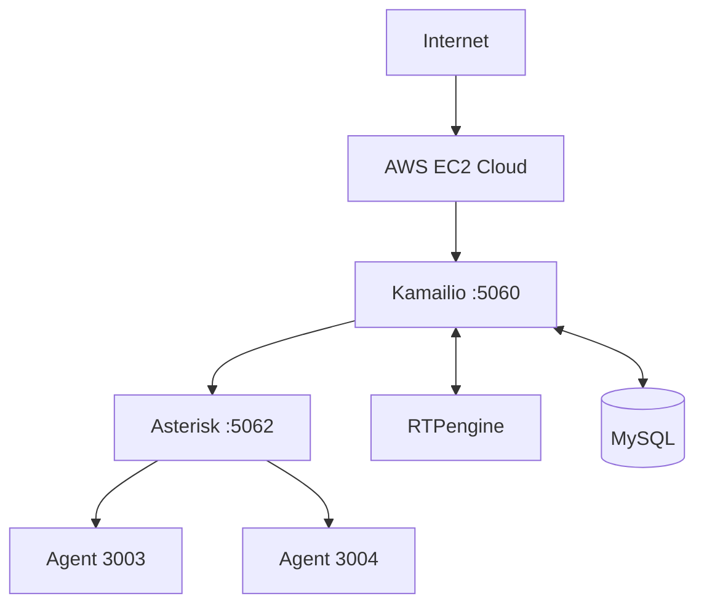

# 🎙️ VoIP Communication Platform

> I built a working VoIP phone system from scratch on AWS EC2 using Kamailio, Asterisk, and RTPengine

[](LICENSE)
[](https://kamailio.org)
[](https://asterisk.org)

---

## 🎯 What I Did

I built a **working VoIP system** to understand how SIP phones work in the cloud.

### What I Configured:

- **Kamailio** as SIP Proxy (port 5060) - handles registration
- **Asterisk** as PBX (port 5062) - handles call routing
- **RTPengine** as Media Proxy - fixes audio issues
- **MySQL** as database - stores user credentials
- **AWS EC2** as cloud server - deployed everything

---

## 🏗️ Architecture Diagram


## ✅ What I Tested

| Test | What I Did | Result |
|------|------------|--------|
| 1 | Register 3001 on Kamailio | ✅ Working |
| 2 | Register 3003 on Asterisk | ✅ Working |
| 3 | Call 1000 from 3001 | ✅ IVR plays |
| 4 | Call 3003 from 3001 | ✅ Connects |
| 5 | Call 3001 from 3003 | ✅ Connects |
| 6 | Two-way audio | ✅ Working |

---

## 🔧 Problems I Solved

| Problem | What Happened | How I Fixed It |
|---------|---------------|----------------|
| **Kamailio wouldn't start** | Syntax error in config | Used `kamailio -c` to find error, fixed line 48 |
| **One-way audio** | Phone could hear me, I couldn't hear phone | Added RTPengine, set `direct_media=no` |
| **3001 wouldn't register** | User not in database | Added to MySQL subscriber table |
| **Port conflict** | Both Kamailio and Asterisk on 5060 | Changed Asterisk to 5062 |
| **SIP scanners attacking** | Random IPs trying to register | Added iptables rules |
| **MySQL root access denied** | Forgot password | Used sudo mysql to reset |

---

## 🛠️ Tools I Used

| Tool | What I Used It For |
|------|-------------------|
| **Kamailio** | SIP Proxy (handles who can call) |
| **Asterisk** | PBX (plays IVR, routes calls) |
| **RTPengine** | Media Proxy (makes audio work through NAT) |
| **MySQL** | Database (stores user credentials) |
| **Linphone** | Softphone (tested 3001, 3002 on iPhone) |
| **MicroSIP** | Softphone (tested 3003, 3004 on Windows) |
| **sngrep** | Debugged SIP messages |
| **tcpdump** | Captured network packets |
| **journalctl** | Checked logs |

---

## 📸 Proof

| Screenshot | What It Shows |
|------------|----------------|
| [01-versions.png](screenshots/01-versions.png) | Kamailio, Asterisk, RTPengine installed |
| [02-kamailio-registrations.png](screenshots/02-kamailio-registrations.png) | 3001 registered in database |
| [03-asterisk-contacts.png](screenshots/03-asterisk-contacts.png) | 3003, 3004 connected to Asterisk |
| [04-sngrep-callflow.png](screenshots/04-sngrep-callflow.png) | SIP INVITE → 200 OK flow |
| [05-ivr-call.png](screenshots/05-ivr-call.png) | Asterisk playing welcome message |
| [06-call-connected.png](screenshots/06-call-connected.png) | Active call between 3001 and 3003 |
| [07-rtp-ports.png](screenshots/07-rtp-ports.png) | Audio flowing through RTPengine |

---

## 📚 What I Learned

| Concept | What I Learned |
|---------|----------------|
| **SIP Protocol** | INVITE, ACK, BYE, REGISTER messages |
| **SIP Response Codes** | 100 Trying, 180 Ringing, 200 OK, 401 Unauthorized, 404 Not Found |
| **Kamailio vs Asterisk** | Kamailio for edge routing, Asterisk for PBX features |
| **RTP vs SIP** | SIP sets up the call, RTP carries the voice |
| **NAT Traversal** | Why one-way audio happens (private IPs in SDP) |
| **RTPengine** | Fixes NAT by rewriting SDP and proxying RTP |
| **Debugging** | sngrep, tcpdump, journalctl, asterisk -r |

---

## 🚀 How to Try It Yourself

```bash
# Clone
git clone https://github.com/Ittzartunk51/voip-sip-platform.git

# Copy configs
sudo cp configs/kamailio/kamailio.cfg /etc/kamailio/
sudo cp configs/asterisk/*.conf /etc/asterisk/
sudo cp configs/rtpengine/rtpengine.conf /etc/rtpengine/

# Setup database
sudo mysql < configs/mysql/schema.sql

# Add users
mysql -u kamailio -p'kamailiorw' -e "USE kamailio; INSERT INTO subscriber (username, domain, password) VALUES ('3001', 'YOUR_IP', 'password123');"

# Start
sudo systemctl restart kamailio asterisk rtpengine-daemon


## 🎯 Test with Softphones

### Test with Linphone (iPhone)

| Setting | Value |
|---------|-------|
| SIP URI | `sip:3001@YOUR_IP:5060` |
| Password | `password123` |
| Transport | UDP |
| Media Encryption | Disabled |

### Test with MicroSIP (Windows)

| Setting | Value |
|---------|-------|
| SIP Server | `YOUR_IP:5062` |
| Username | `3003` |
| Password | `agent3003` |
| Domain | `YOUR_IP` |
| Transport | UDP |

### Test Calls

| From | To | Expected Result |
|------|-----|-----------------|
| 3001 (Linphone) | 1000 | Hear IVR welcome message |
| 3001 (Linphone) | 3003 | 3003 rings, answer, audio works |
| 3003 (MicroSIP) | 3001 | 3001 rings, answer, audio works |

---


## 🔮 Phase 2 - What's Next

I'm continuing to build on this project. Here's what I plan to add:

| Feature | Description | Status |
|---------|-------------|--------|
| **Full IVR Menu** | "Press 1 for Voice Agent, Press 2 for Network Agent" | 🔜 Planned |
| **WebRTC Gateway** | Make calls directly from web browser (no app needed) | 🔜 Planned |
| **Admin Dashboard** | Real-time call monitoring web interface | 🔜 Planned |
| **Call Recording** | Record calls for quality monitoring | 🔜 Planned |
| **Queue System** | Multiple agents waiting for calls | 🔜 Planned |

### Why These Features?

| Feature | Why I Want to Build It |
|---------|------------------------|
| **WebRTC** | So anyone can call from a browser link |
| **Dashboard** | To see live calls, agent status, call history |
| **Queue** | To handle multiple callers efficiently |

---
